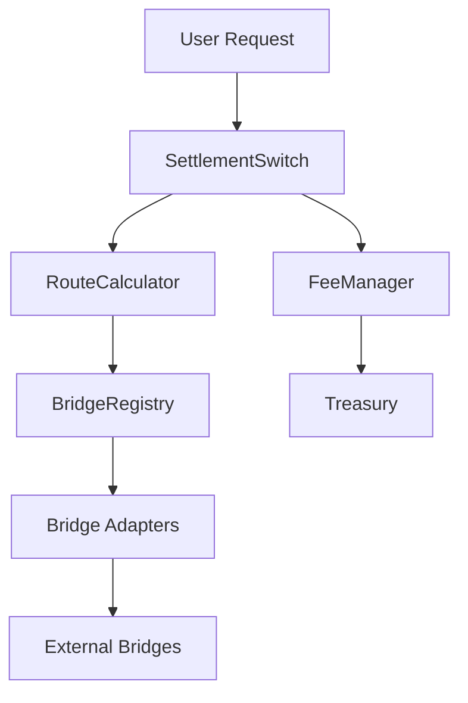

# SettlementSwitch 🌉

A  intelligent cross-chain settlement system that automatically routes transfers between Ethereum, Arbitrum, and Polygon networks using optimal cost and speed algorithms.

[](https://opensource.org/licenses/MIT)
[](https://getfoundry.sh/)
[](https://soliditylang.org/)

## 🚀 Features

- **Intelligent Route Selection**: Automatically finds optimal routes based on cost, speed, and reliability
- **Multi-Bridge Support**: Integrates with LayerZero, Hop Protocol, Polygon Bridge, Arbitrum Bridge, Across, and Connext
- **Advanced Routing Modes**: CHEAPEST, FASTEST, and BALANCED routing algorithms
- **Multi-Path Routing**: Splits large transfers across multiple bridges for better liquidity
- **Real-Time Price Feeds**: Chainlink integration for accurate cost calculations
- **Comprehensive Security**: Rate limiting, slippage protection, emergency controls
- **Gas Optimized**: Efficient algorithms and storage patterns
- **Production Ready**: Extensive testing, monitoring, and upgrade mechanisms

## 📋 Table of Contents

- [Architecture](#-architecture)
- [Supported Networks](#-supported-networks)
- [Installation](#-installation)
- [Configuration](#-configuration)
- [Deployment](#-deployment)
- [Usage](#-usage)
- [Testing](#-testing)
- [Security](#-security)
- [Gas Optimization](#-gas-optimization)
- [Monitoring](#-monitoring)
- [Contributing](#-contributing)
- [License](#-license)

## 🏗 Architecture

### Core Components

```
SettlementSwitch/
├── SettlementSwitch.sol      # Main orchestration contract
├── RouteCalculator.sol       # Route optimization engine
├── BridgeRegistry.sol        # Bridge adapter management
└── FeeManager.sol           # Fee collection and distribution
```

### Bridge Adapters

```
adapters/
├── LayerZeroAdapter.sol      # Stargate integration
├── HopProtocolAdapter.sol    # Hop Protocol integration
├── PolygonBridgeAdapter.sol  # Native Polygon bridge
├── ArbitrumBridgeAdapter.sol # Native Arbitrum bridge
├── AcrossAdapter.sol         # Across Protocol integration
└── ConnextAdapter.sol        # Connext (Amarok) integration
```

### System Flow



## 🌐 Supported Networks

### Testnet Configuration
- **Ethereum Sepolia** (Chain ID: 11155111)
- **Arbitrum Sepolia** (Chain ID: 421614)
- **Polygon Mumbai** (Chain ID: 80001)

### Mainnet Configuration (Production Ready)
- **Ethereum Mainnet** (Chain ID: 1)
- **Arbitrum One** (Chain ID: 42161)
- **Polygon Mainnet** (Chain ID: 137)

### Supported Tokens
- **ETH/WETH**: Native Ethereum
- **USDC**: USD Coin stablecoin
- **USDT**: Tether stablecoin
- **DAI**: Dai stablecoin
- **MATIC**: Polygon native token

## 🛠 Installation

### Prerequisites

- [Foundry](https://getfoundry.sh/) (latest version)
- [Node.js](https://nodejs.org/) v16+ (for additional tooling)
- [Git](https://git-scm.com/)

### Setup

1. **Clone the repository**
   ```bash
   git clone https://github.com/your-org/settlement-switch.git
   cd settlement-switch
   ```

2. **Install dependencies**
   ```bash
   forge install
   ```

3. **Set up environment variables**
   ```bash
   cp .env.example .env
   # Edit .env with your configuration
   ```

4. **Build the project**
   ```bash
   forge build
   ```

5. **Run tests**
   ```bash
   forge test
   ```

## ⚙️ Configuration

### Environment Variables

Copy `.env.example` to `.env` and configure:

```bash
# Private key for deployment
PRIVATE_KEY=your_private_key_here

# RPC endpoints
ETHEREUM_SEPOLIA_RPC=https://sepolia.infura.io/v3/YOUR_KEY
ARBITRUM_SEPOLIA_RPC=https://arbitrum-sepolia.infura.io/v3/YOUR_KEY
POLYGON_MUMBAI_RPC=https://polygon-mumbai.infura.io/v3/YOUR_KEY

# API keys for verification
ETHERSCAN_API_KEY=your_etherscan_key
ARBISCAN_API_KEY=your_arbiscan_key
POLYGONSCAN_API_KEY=your_polygonscan_key

# Admin addresses
ADMIN_ADDRESS_TESTNET=0x742d35Cc6634C0532925a3b8D4C9db96C4b4d8b6
TREASURY_ADDRESS_TESTNET=0x742d35Cc6634C0532925a3b8D4C9db96C4b4d8b6
```

### Network Configuration

The system supports multiple deployment configurations:

```solidity
// Testnet deployment
forge script script/Deploy.s.sol --rpc-url sepolia --broadcast --verify

// Local testing
forge script script/Deploy.s.sol --rpc-url localhost --broadcast
```

## 🚀 Deployment

### Testnet Deployment

1. **Deploy to Sepolia**
   ```bash
   forge script script/Deploy.s.sol --rpc-url sepolia --broadcast --verify
   ```

2. **Deploy to Arbitrum Sepolia**
   ```bash
   forge script script/Deploy.s.sol --rpc-url arbitrum_sepolia --broadcast --verify
   ```

3. **Deploy to Mumbai**
   ```bash
   forge script script/Deploy.s.sol --rpc-url mumbai --broadcast --verify
   ```

### Local Development

1. **Start local node**
   ```bash
   anvil
   ```

2. **Deploy locally**
   ```bash
   forge script script/Deploy.s.sol --rpc-url localhost --broadcast
   ```

### Mainnet Deployment (Production)

⚠️ **WARNING**: Mainnet deployment requires careful review and testing.

```bash
# Uncomment mainnet configurations in Deploy.s.sol
# Set proper admin addresses and treasury
forge script script/Deploy.s.sol --rpc-url mainnet --broadcast --verify
```

## 📖 Usage

### Basic Transfer

```solidity
import "./src/interfaces/ISettlementSwitch.sol";

// Initialize preferences
IBridgeAdapter.RoutePreferences memory prefs = IBridgeAdapter.RoutePreferences({
    mode: IBridgeAdapter.RoutingMode.CHEAPEST,
    maxSlippageBps: 100,        // 1% max slippage
    maxFeeWei: 0.1 ether,       // Max $200 fee
    maxTimeMinutes: 60,         // 1 hour max
    allowMultiHop: false
});

// Execute transfer with auto-route
bytes32 transferId = settlementSwitch.bridgeWithAutoRoute{value: 0.01 ether}(
    address(usdc),              // tokenIn
    address(usdc),              // tokenOut
    1000 * 1e6,                // amount (1000 USDC)
    11155111,                   // srcChainId (Sepolia)
    80001,                      // dstChainId (Mumbai)
    recipient,                  // recipient
    prefs,                      // preferences
    ""                          // permitData
);
```

### Advanced Usage

#### Multi-Path Routing for Large Amounts

```solidity
// Find multi-path route for large transfer
ISettlementSwitch.MultiPathRoute memory multiPath = settlementSwitch.findMultiPathRoute(
    address(usdc),
    address(usdc),
    100000 * 1e6,              // 100k USDC
    11155111,                   // Sepolia
    137,                        // Polygon Mainnet
    prefs
);

// Execute multi-path transfer
bytes32[] memory transferIds = settlementSwitch.executeMultiPathBridge{value: 1 ether}(
    multiPath,
    recipient,
    ""
);
```

#### Route Comparison

```solidity
// Get multiple routes for comparison
IBridgeAdapter.Route[] memory routes = settlementSwitch.findMultipleRoutes(
    address(usdc),
    address(usdc),
    1000 * 1e6,
    11155111,
    80001,
    prefs,
    5                           // max routes
);

// Compare costs and times
for (uint i = 0; i < routes.length; i++) {
    console.log("Route", i);
    console.log("Bridge:", routes[i].adapter);
    console.log("Cost:", routes[i].metrics.totalCostWei);
    console.log("Time:", routes[i].metrics.estimatedTimeMinutes);
}
```

### Integration Examples

#### Frontend Integration (TypeScript)

```typescript
import { ethers } from 'ethers';
import SettlementSwitchABI from './abi/SettlementSwitch.json';

class SettlementSwitchClient {
    private contract: ethers.Contract;
    
    constructor(address: string, provider: ethers.Provider) {
        this.contract = new ethers.Contract(address, SettlementSwitchABI, provider);
    }
    
    async findOptimalRoute(
        tokenIn: string,
        tokenOut: string,
        amount: bigint,
        srcChainId: number,
        dstChainId: number,
        preferences: RoutePreferences
    ) {
        return await this.contract.findOptimalRoute(
            tokenIn, tokenOut, amount, srcChainId, dstChainId, preferences
        );
    }
    
    async executeBridge(route: Route, recipient: string, value: bigint) {
        return await this.contract.executeBridge(route, recipient, "0x", { value });
    }
}
```

#### Backend Integration (Node.js)

```javascript
const { ethers } = require('ethers');

class BridgeMonitor {
    constructor(settlementSwitchAddress, provider) {
        this.contract = new ethers.Contract(
            settlementSwitchAddress,
            SettlementSwitchABI,
            provider
        );
        this.setupEventListeners();
    }
    
    setupEventListeners() {
        // Monitor transfer events
        this.contract.on('TransferInitiated', (transferId, user, route, timestamp) => {
            console.log(`Transfer initiated: ${transferId}`);
            this.trackTransfer(transferId);
        });
        
        this.contract.on('TransferCompleted', (transferId, actualCost, actualTime) => {
            console.log(`Transfer completed: ${transferId}`);
            this.updateMetrics(transferId, actualCost, actualTime);
        });
    }
    
    async trackTransfer(transferId) {
        // Implementation for transfer tracking
    }
}
```

## 🧪 Testing

### Run All Tests

```bash
forge test
```

### Run Specific Tests

```bash
# Test route calculation
forge test --match-test testFindOptimalRoute

# Test with specific verbosity
forge test -vvv

# Test with gas reporting
forge test --gas-report
```

### Coverage Report

```bash
forge coverage
```

### Fuzz Testing

```bash
# Run fuzz tests with custom parameters
forge test --fuzz-runs 10000
```

### Integration Tests

```bash
# Test specific scenario from requirements
forge test --match-test test_Route1000USDCSepoliaToMumbai_Cheapest -vvv
```

### Test Commands

```bash
# Quick test suite
make test-quick

# Full test suite with coverage
make test-full

# Gas optimization tests
make test-gas

# Security tests
make test-security
```

## 🔒 Security

### Security Features

- **Reentrancy Protection**: All external calls protected with ReentrancyGuard
- **Access Control**: Role-based permissions with OpenZeppelin AccessControl
- **Rate Limiting**: Minimum 10-second intervals between transfers
- **Daily Limits**: Configurable daily transfer limits per user
- **Slippage Protection**: Maximum slippage enforcement
- **Emergency Controls**: Pause functionality and emergency withdrawal
- **Input Validation**: Comprehensive parameter validation

### Security Considerations

1. **Private Key Management**
   - Use hardware wallets for mainnet
   - Separate keys for different environments
   - Regular key rotation

2. **Smart Contract Security**
   - Comprehensive test coverage (>95%)
   - Formal verification for critical functions
   - Regular security audits
   - Bug bounty program

3. **Operational Security**
   - Multi-signature wallets for admin functions
   - Time-locked upgrades
   - Monitoring and alerting systems

### Audit Checklist

- [ ] Reentrancy protection on all external calls
- [ ] Integer overflow/underflow protection
- [ ] Access control on admin functions
- [ ] Input validation on all parameters
- [ ] Emergency pause mechanisms
- [ ] Upgrade safety checks
- [ ] Gas limit considerations
- [ ] Front-running protection

## ⚡ Gas Optimization

### Optimization Techniques

1. **Storage Optimization**
   - Packed structs to minimize storage slots
   - Use of events instead of storage where possible
   - Efficient data structures

2. **Computation Optimization**
   - Assembly for critical path operations
   - Efficient sorting algorithms
   - Batch operations

3. **Call Optimization**
   - Minimal external calls
   - Efficient route caching
   - Optimized bridge selection

### Gas Costs

| Operation | Estimated Gas | Cost (30 gwei) |
|-----------|---------------|-----------------|
| Route Calculation | ~150,000 | ~$9 |
| Bridge Execution | ~300,000 | ~$18 |
| Multi-Path Route | ~500,000 | ~$30 |

### Gas Optimization Commands

```bash
# Generate gas report
forge test --gas-report

# Optimize specific function
forge test --match-test testGasOptimization_RouteCalculation --gas-report

# Profile gas usage
forge test --gas-report > gas-report.txt
```

## 📊 Monitoring

### Metrics and Analytics

The system emits comprehensive events for monitoring:

```solidity
event RouteCalculated(
    address indexed user,
    uint256 indexed srcChain,
    uint256 indexed dstChain,
    uint256 estimatedCost,
    uint256 estimatedTime,
    address adapter
);

event TransferInitiated(
    bytes32 indexed transferId,
    address indexed user,
    IBridgeAdapter.Route route,
    uint256 timestamp
);

event TransferCompleted(
    bytes32 indexed transferId,
    uint256 actualCost,
    uint256 actualTime,
    bool successful
);
```

### Integration with Monitoring Services

#### The Graph Protocol

```graphql
# Example GraphQL query
{
  transfers(first: 100, orderBy: timestamp, orderDirection: desc) {
    id
    user
    amount
    srcChain
    dstChain
    status
    cost
    timestamp
  }
}
```

#### OpenZeppelin Defender

```javascript
// Defender Sentinel configuration
const sentinel = {
  name: 'SettlementSwitch Monitor',
  addresses: ['0x...'], // SettlementSwitch address
  events: [
    'TransferInitiated',
    'TransferCompleted',
    'TransferFailed',
    'EmergencyPause'
  ],
  conditions: {
    // Alert on large transfers
    'TransferInitiated': 'amount > 100000000000' // > 100k USDC
  }
};
```

### Health Checks

```bash
# Check system health
forge script script/HealthCheck.s.sol --rpc-url sepolia

# Monitor bridge status
forge script script/BridgeStatus.s.sol --rpc-url sepolia
```

## 🤝 Contributing

We welcome contributions! Please see our [Contributing Guidelines](CONTRIBUTING.md) for details.

### Development Workflow

1. Fork the repository
2. Create a feature branch
3. Make your changes
4. Add tests for new functionality
5. Ensure all tests pass
6. Submit a pull request

### Code Standards

- Follow Solidity style guide
- Comprehensive NatSpec documentation
- >95% test coverage
- Gas optimization considerations
- Security best practices

### Pull Request Process

1. Update documentation
2. Add/update tests
3. Ensure CI passes
4. Request review from maintainers
5. Address feedback
6. Merge after approval

## 📚 Additional Resources

### Documentation

- [Technical Architecture](docs/architecture.md)
- [API Reference](docs/api.md)
- [Integration Guide](docs/integration.md)
- [Security Guide](docs/security.md)
- [Troubleshooting](docs/troubleshooting.md)

### Examples

- [Frontend Integration](examples/frontend/)
- [Backend Integration](examples/backend/)
- [Mobile Integration](examples/mobile/)

### Community

- [Discord](https://discord.gg/settlement-switch)
- [Telegram](https://t.me/settlement_switch)
- [Twitter](https://twitter.com/settlement_switch)

## 🐛 Troubleshooting

### Common Issues

1. **"Route not found" error**
   - Check if chains are supported
   - Verify token addresses
   - Ensure sufficient liquidity

2. **"Insufficient liquidity" error**
   - Try smaller amount
   - Use multi-path routing
   - Check bridge health status

3. **High gas costs**
   - Use CHEAPEST routing mode
   - Consider L2 alternatives
   - Batch multiple transfers

4. **Transaction reverts**
   - Check slippage settings
   - Verify token approvals
   - Ensure sufficient balance

### Debug Commands

```bash
# Debug specific transaction
forge run --debug <tx_hash>

# Trace function calls
forge test --match-test <test_name> --trace

# Check contract state
cast call <contract_address> "getTransfer(bytes32)" <transfer_id>
```

### Support

For technical support:
- Create an issue on GitHub
- Join our Discord community
- Email: support@settlement-switch.com

## 📄 License

This project is licensed under the MIT License - see the [LICENSE](LICENSE) file for details.

## ⚠️ Disclaimer

This software is provided "as is" without warranty. Use at your own risk. Always test thoroughly on testnets before mainnet deployment. The developers are not responsible for any loss of funds.

---

**Built with ❤️ by the SettlementSwitch team**

*Making cross-chain transfers seamless, secure, and cost-effective.*